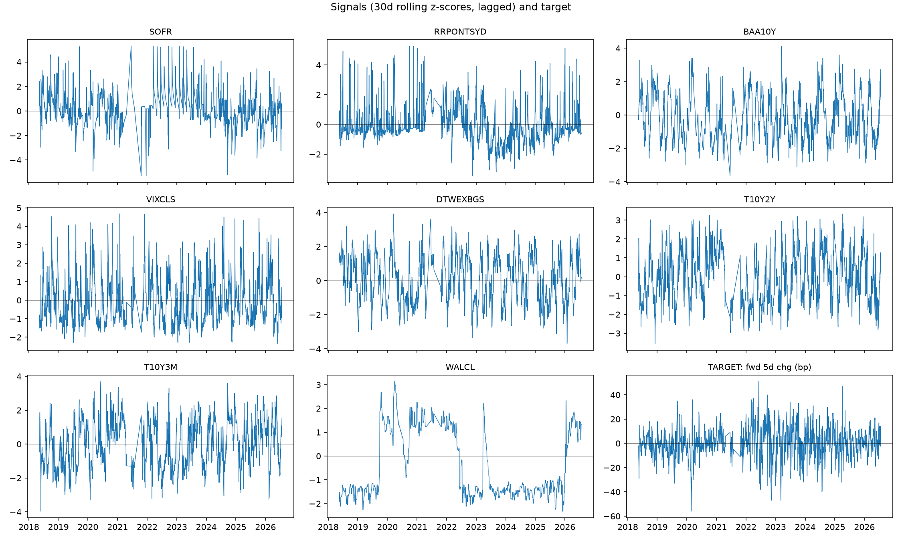
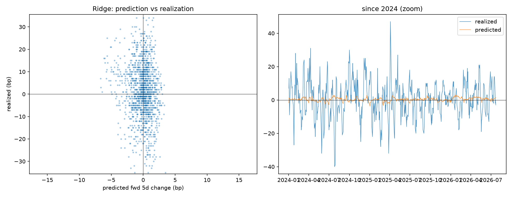
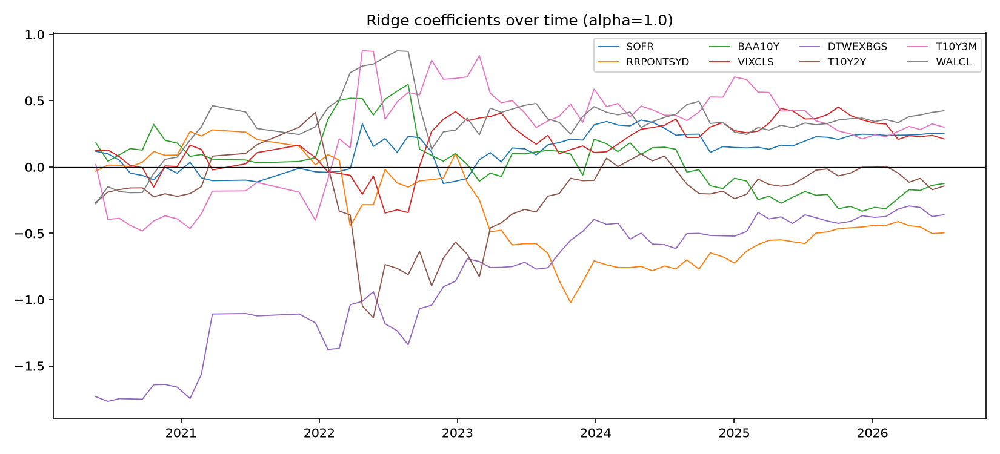
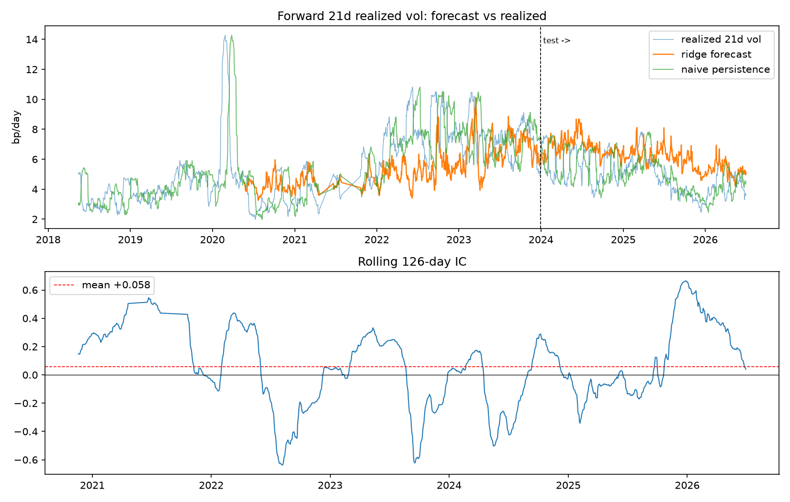
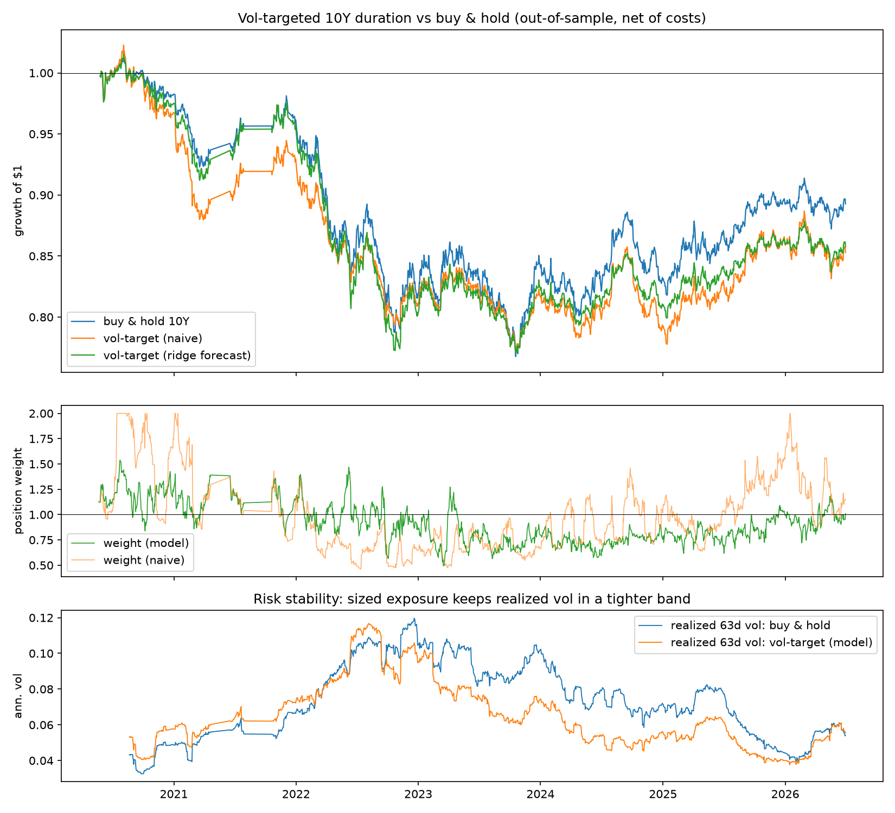

# Forecasting U.S. Treasury Yield Volatility from Funding-Liquidity Signals

A walk-forward machine-learning study of whether public funding/liquidity
stress indicators predict U.S. 10-Year Treasury yield behavior out of sample.

**Headline finding.** The *direction* of weekly yield changes is not
predictable from public liquidity signals (robust null result, documented
below). The *volatility* of yield changes is predictable: a rolling-window
ridge model forecasts forward 21-day realized volatility with out-of-sample
IC of **+0.54** (validation 2020–2023) and **+0.43** (untouched test
2024–2026). Applied to volatility-targeted duration sizing, the forecast cuts
realized portfolio volatility by ~12% and keeps risk in a markedly tighter
band than buy-and-hold.

## Research question

> Do funding/liquidity conditions — the cost and abundance of short-term
> dollar funding — contain exploitable information about U.S. Treasury yields?

Economic hypothesis: when dollar funding is stressed (SOFR elevated, reverse
repo usage abnormal, credit spreads wide, risk appetite weak), investors flee
to Treasuries, affecting both the level and the variability of yields.

## Data

All series are public, from FRED (Federal Reserve Bank of St. Louis), via the
keyless CSV endpoint — anyone can reproduce this dataset.

| Series | Description | Role |
|---|---|---|
| DGS10 | 10-Year Treasury yield (%) | target |
| SOFR | Secured Overnight Financing Rate | funding cost |
| RRPONTSYD | Fed ON RRP facility usage ($bn) | liquidity abundance |
| BAA10Y | Moody's Baa corporate yield minus 10Y | credit stress |
| VIXCLS | CBOE VIX | risk appetite |
| DTWEXBGS | Nominal broad USD index | global risk-off proxy |
| T10Y2Y, T10Y3M | Term spreads | curve shape / policy expectations |
| WALCL | Fed total assets (weekly) | QE/QT balance-sheet proxy |

Sample: **2018-04 → 2026-06** (start set by SOFR's first publication in April
2018; ~2,080 trading days). The ICE BofA OAS series were considered but
dropped — FRED restructured them in Aug 2023 and their history was lost;
Moody's Baa spread provides the same signal back to 1986.

## Methodology

**Features.** Each signal is a trailing 30-day rolling z-score (13 weeks for
the weekly WALCL) — "how many standard deviations is today's reading from its
own recent norm", the same construction I used for a liquidity pressure index
in a sell-side strategy internship.

**Leakage discipline** (the part that matters most):
- rolling windows are trailing only — no future data in any feature;
- all features lagged 1 day (publication lag: e.g. SOFR prints the next
  morning); WALCL lagged an extra 7 days (released ~a week after as-of date);
- at every refit, training rows whose forward-looking target window overlaps
  the prediction day are embargoed (dropped);
- model selection used only the validation segment (2020–2023); 2024–2026 was
  kept as an untouched test segment.

**Validation.** Walk-forward with monthly refits; OLS baseline vs Ridge
(rolling 3-year window, alpha=100) — never a random train/test split, which
leaks through overlapping time-series targets.



## Experiment 1 — Direction: an honest null result

Predicting the forward 5-day change in the 10Y yield (walk-forward, 2020–2026 OOS):

| Model | OOS R² | Hit rate | IC | Newey–West t |
|---|---|---|---|---|
| OLS | −0.054 | 45.7% | −0.152 | −3.47 |
| Ridge | −0.054 | 45.7% | −0.152 | −3.47 |

Alternative specifications (21-day horizon, random forests) fail the same
way. Diagnosis: the signal→yield relationship **flips sign across policy
regimes** (e.g., USD–yield correlation moved from −0.16 pre-2022 to +0.04
post-2022), so any trailing-window estimate is systematically one regime
behind. Weekly yield direction from public liquidity data is, on this
evidence, not stably predictable — and a model that claims otherwise is
probably overfit.





## Experiment 2 — Volatility: the predictable quantity

Target: log of forward 21-trading-day realized volatility of daily yield
changes. Features: the 8 stress z-scores + log backward 5d/21d realized vol
(vol clustering). Rolling 3-year ridge, monthly refit, 21-row embargo.

| Segment | OOS R² (log-vol) | OOS IC |
|---|---|---|
| validation 2020–2023 | +0.25 | **+0.54** |
| test 2024–2026 | −0.75 | **+0.43** |

Reading: the *ranking* of upcoming vol regimes is robustly forecastable
(stress signals carry stable, positive-signed information, and volatility
clusters strongly). The *level* calibration degrades across the post-2023
vol-regime break — every trailing method, including naive persistence,
overshoots in the calm 2024–2026 regime (its R² is also negative), which is
why the volatility literature evaluates models on IC and R² relative to the
persistence benchmark rather than absolute R².



## Application — volatility-targeted duration sizing

Position sizing for a long 10Y-duration exposure (DURATION=8 return
approximation), weight = clip(5 bp / predicted vol, 0, 2), executed with a
1-day lag, 1 bp cost per unit turnover, OOS only (2020-05 → 2026-06):

| Strategy | Ann. ret | Ann. vol | Sharpe | Max DD | Vol-of-vol |
|---|---|---|---|---|---|
| buy & hold | −1.7% | 7.6% | −0.23 | −24.2% | 0.021 |
| vol-target (ridge forecast) | −2.5% | 6.7% | −0.37 | −24.2% | 0.019 |
| vol-target (naive) | −2.6% | 6.8% | −0.38 | −24.5% | **0.005** |

Honest interpretation: sizing is a **risk tool, not an alpha source**. It
performed its design function — realized vol down ~12%, and risk held in a
tight band through the 2022–2024 rate-shock era (buy-and-hold vol swung
3×) — but it cannot rescue a negative-drift asset in a bond bear market, and
this report does not pretend otherwise.



## Limitations & future work

- SOFR-era only (2018+); pre-2018 would need discontinued LIBOR-based series.
- Daily frequency; intraday funding data (e.g. SOFR futures, swap spreads)
  would sharpen the signals.
- Linear ridge chosen for interpretability; gradient boosting with regime
  interactions is a natural next step (tested here — it did not rescue
  directional prediction).
- Duration is approximated with a constant-8 modified duration, no convexity
  or futures roll modeling.

## Repository structure & reproduction

```
treasury-yield-forecast/
├── data/                     # raw FRED csvs + built datasets (generated)
├── output/                   # figures (generated)
├── src/
│   ├── fetch_data.py         # download & cache FRED series
│   ├── build_features.py     # calendar align, z-scores, lags, targets
│   ├── experiment1_direction.py   # walk-forward direction test (null result)
│   ├── experiment2_volatility.py  # rolling-ridge vol forecast (main model)
│   └── backtest.py           # vol-targeted duration sizing
└── requirements.txt
```

```bash
python -m venv .venv && .venv/Scripts/pip install -r requirements.txt
.venv/Scripts/python src/fetch_data.py
.venv/Scripts/python src/build_features.py
.venv/Scripts/python src/experiment1_direction.py
.venv/Scripts/python src/experiment2_volatility.py
.venv/Scripts/python src/backtest.py
```
